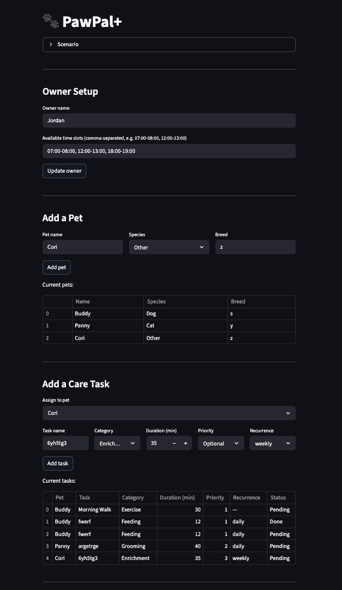
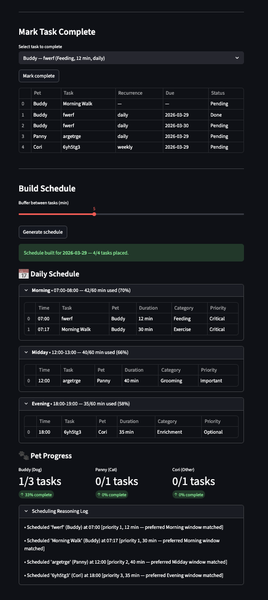

# PawPal+ (Module 2 Project)

You are building **PawPal+**, a Streamlit app that helps a pet owner plan care tasks for their pet.

## Scenario

A busy pet owner needs help staying consistent with pet care. They want an assistant that can:

- Track pet care tasks (walks, feeding, meds, enrichment, grooming, etc.)
- Consider constraints (time available, priority, owner preferences)
- Produce a daily plan and explain why it chose that plan

Your job is to design the system first (UML), then implement the logic in Python, then connect it to the Streamlit UI.

## What you will build

Your final app should:

- Let a user enter basic owner + pet info
- Let a user add/edit tasks (duration + priority at minimum)
- Generate a daily schedule/plan based on constraints and priorities
- Display the plan clearly (and ideally explain the reasoning)
- Include tests for the most important scheduling behaviors

## Features

| Feature | Description |
|---|---|
| **Priority-based sorting** | Tasks are sorted by `(priority, pet_name, duration)` before placement, so Critical tasks always claim the earliest available slot |
| **Category-preferred time windows** | Each category (Feeding, Exercise, Grooming, Medical, Enrichment) has preferred time-of-day windows (Morning, Midday, Afternoon, Evening); the scheduler tries those first before falling back to any open slot |
| **Configurable task buffer** | A user-adjustable gap (default 5 min) is inserted between consecutive tasks within a slot to prevent back-to-back scheduling without transition time |
| **Chronological display** | Scheduled entries within each time window are displayed sorted by start time |
| **Slot utilization report** | Each availability window shows used/total minutes and a utilization percentage |
| **Conflict detection** | A pairwise interval-overlap scan (`a.start < b.end AND b.start < a.end`) flags every overlapping pair, reporting overlap duration and whether the conflict is within the same pet or across pets |
| **Daily & weekly recurrence** | Completing a recurring task automatically queues a fresh copy with `due_date` advanced by 1 day (daily) or 7 days (weekly); the action is logged in the reasoning log |
| **Task filtering** | `filter_tasks(completed, pet_name)` scans all pet task lists directly so completed and pending tasks remain queryable after the scheduler has run |
| **Unscheduled task suggestions** | When a task can't fit, the output identifies the slot with the most remaining free time and suggests exactly how many minutes to extend it |
| **Critical task alerts** | Priority-1 tasks that fail to schedule produce a prominent warning banner separate from ordinary unscheduled tasks |
| **Per-pet completion progress** | After each schedule build, each pet shows a done/total task count and completion percentage |
| **Scheduling reasoning log** | Every placement decision (including preferred-window matches, fallbacks, and recurring-task queues) is recorded and shown as a collapsible log |

---

## Smarter Scheduling

Beyond the basic daily plan, PawPal+ includes three algorithmic extensions:

### Task Filtering
`Scheduler.filter_tasks(completed, pet_name)` searches across all pets' task lists
directly, so you can query completed or pending tasks even after the scheduler has run.
Both parameters are optional and can be combined.

```python
scheduler.filter_tasks(completed=False, pet_name="Buddy")  # Buddy's pending tasks
scheduler.filter_tasks(completed=True)                      # all done tasks, any pet
```

### Recurring Tasks
`CareTask` accepts a `recurrence` field (`"daily"` or `"weekly"`) and a `due_date`.
When `Scheduler.complete_task(task)` is called on a recurring task it automatically:
- marks the current instance complete
- creates a fresh copy with `due_date` advanced by 1 or 7 days
- appends the new copy to the same pet's task list
- logs the action in the reasoning log

One-off tasks (no `recurrence`) behave as before — `complete_task` returns `None`.

### Conflict Detection
`Scheduler.detect_conflicts()` performs a pairwise scan of `scheduled_entries` using
the standard interval-overlap test (`a.start < b.end AND b.start < a.end`). It returns
a list of `ScheduleConflict` objects, each recording the two entries, the overlap in
minutes, and whether they belong to the same pet or different pets.

`send_plan()` calls this automatically and prints a prominent
`[!] SCHEDULE CONFLICTS DETECTED` banner at the top of the output if any overlaps are
found. The normal `build_schedule` path always produces zero conflicts; the check acts
as a validation guard for any external modifications to `scheduled_entries`.

---

## Testing PawPal+

Run the full test suite from the project root:

```bash
python -m pytest tests/test_pawpal.py -v
```

The 9 tests cover the following behaviors:

| Test | What it verifies |
|---|---|
| `test_mark_complete_changes_status` | `mark_complete()` flips `completed` from `False` to `True` |
| `test_add_task_increases_pet_task_count` | `Pet.add_task()` appends the task to the pet's list |
| `test_build_schedule_entries_are_chronological` | After `build_schedule()`, entries are in ascending time order and the highest-priority task occupies the earliest slot |
| `test_detect_conflicts_flags_duplicate_start_times` | Two tasks at the same start time produce one conflict with correct `same_pet` and `overlap_minutes` values |
| `test_completing_recurring_task_twice_adds_duplicate` | Calling `complete_task()` on an already-completed recurring task silently queues a second next occurrence (documents known behavior) |
| `test_complete_task_raises_for_orphaned_task` | `complete_task()` raises `ValueError` when the task is not attached to any pet |
| `test_adjacent_tasks_are_not_a_conflict` | Tasks that touch but do not overlap (`a.end == b.start`) are not flagged as conflicts |
| `test_overlapping_availability_windows_double_count_minutes` | `parse_time_slots()` does not merge overlapping windows — each is parsed as a separate slot (documents known limitation) |
| `test_empty_string_recurrence_returns_none` | `next_occurrence()` returns `None` for `recurrence=""`, not just `None` |

Confidence Level: 4 stars, All tests work for all edge cases thought of. However, with some complexity in the code, there may be some errors in the code that I can't percieve. Although I have a pretty good understanding of the job of the code, I only have a moderate understanding(after prompting AI to help) of the code itself. This may result in some hidden edge case that I would not know to test for.

---

📸 Demo

<a href="image-2.png" target="_blank"></a>
<a href="image-3.png" target="_blank"></a>
