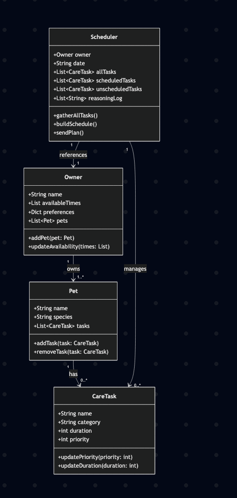

# PawPal+ Project Reflection

## 1. System Design

Three core actions a user should be able to perform are:
    1. adding a pet
    2. Scheduling meal times for pet
    3. Let the user see each day's schedule/task

Class/Object: Owner
    Attributes:
        - Owner name
        - Owner available times
        - Owner pets
    Methods:
        - add pet()
        - update availability() <-- In case owner wants to change available time

Class/Object: Pet
    Attributes:
        - Pet name
        - Pet species
        - pet tasks <-- Last of tasks(the object)/assignments the pet has to do 
    Methods:
        - add task()
        - remove task()  

Class/Object: CareTask
    Attributes:
        - Task name <-- like evening walk or lunch time
        - Task category(Grooming, feeding, medical, etc.)
        - Task duration <-- how long a task takes
        - Task priority(1. Critical/very important to 3. Optional/not essential)
    Methods:
        - update priority()
        - update duration()

Class/Object: Scheduler
    Attributes:
        - Owner object <-- Need Owner's available times and other information
        - date
        - all tasks <-- a list with tasks of all pets(unsorted)
        - scheduled tasks <-- a list where all Scheduled tasks from scheduleer goes into
        - unscheduled tasks <-- a list where all Unscheduled tasks from scheduler goes into
        - reasoning log <-- a list which holds all generate reasoning results together
    Methods:
        - gather all tasks(): Take every CareTask from the owner's Pet objects and add that to all tasks 
        - build schedule(): First this method sorts the all tasks by priority, then task duration. Next it compares each sorted task against the user's availability time, and sends the task into Sceduled or Unscheduled tasks list based on that. Then it creates a log on why the task got sent into Scheduled or Unscheduled list based on User's availability time and adds that to the resoning log list. 
        - send plan(): Sends plan in proper format to streamlit 
    
**a. Initial design**

- Briefly describe your initial UML design.
- What classes did you include, and what responsibilities did you assign to each?

My initial UML design had the scheduler class as the main aspect of the system. The scheduler class references both the owner class and the pet class, and also manages the CareTask class. I also had my owner class "own" the pet class, and my pet class "has" the Caretask class. Of the 4 classes I have, the owner class' responsibility was to have ownership of the pet class and have a list of available times. The pet class was responsible for its species and the set of tasks the pet had to complete. The CareTask class was responsible for actually containing those tasks such as their priority, duration, and name/description. Finally the scheduler uses data from all these 3 classes to first sort the tasks, then categorize them into Scheduled/Unscheduled tasks and a log for why it was put in set category. Finally, I had the scheduler also format the plan properly to send to streamlit. More information is above.

**b. Design changes**

- Did your design change during implementation?
- If yes, describe at least one change and why you made it.

Yes, my design changed a little bit becoming more precise with the help of AI. for example, the AI helped create some more logical methods like update species info or to have send_plan() return a proper string format for Streamlit. However my favorite update was to parse the raw time data from just strings into actual datetime objects. This ensures that we don't have any logic bottlenecks due to the time being parsed wrongly in strings. This actually ended up becoming a new class that wraps Caretask class with a new time entry.
---

## 2. Scheduling Logic and Tradeoffs

**a. Constraints and priorities**

- What constraints does your scheduler consider (for example: time, priority, preferences)?
- How did you decide which constraints mattered most?

**b. Tradeoffs**

- Describe one tradeoff your scheduler makes.
- Why is that tradeoff reasonable for this scenario?

---

## 3. AI Collaboration

**a. How you used AI**

- How did you use AI tools during this project (for example: design brainstorming, debugging, refactoring)?
- What kinds of prompts or questions were most helpful?

**b. Judgment and verification**

- Describe one moment where you did not accept an AI suggestion as-is.
- How did you evaluate or verify what the AI suggested?

---

## 4. Testing and Verification

**a. What you tested**

- What behaviors did you test?
- Why were these tests important?

**b. Confidence**

- How confident are you that your scheduler works correctly?
- What edge cases would you test next if you had more time?

---

## 5. Reflection

**a. What went well**

- What part of this project are you most satisfied with?

**b. What you would improve**

- If you had another iteration, what would you improve or redesign?

**c. Key takeaway**

- What is one important thing you learned about designing systems or working with AI on this project?

