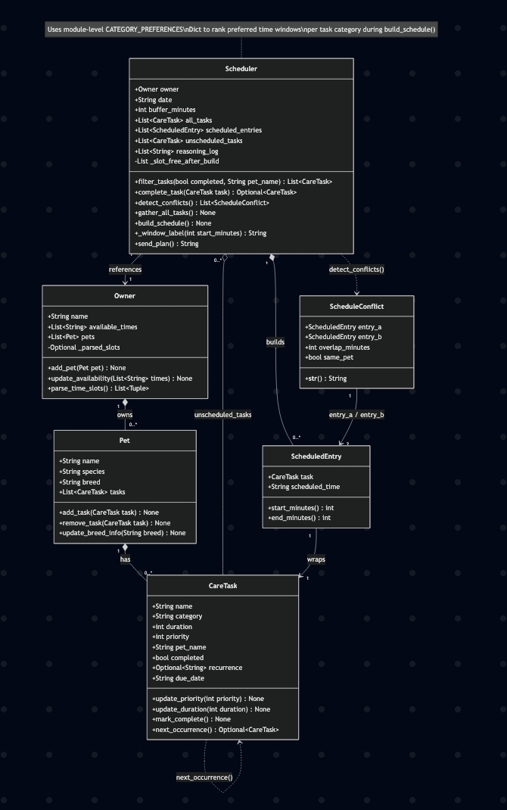

# PawPal+ Project Reflection

## 1. System Design

Three core actions a user should be able to perform are:
    1. adding a pet
    2. Scheduling meal times for pet
    3. Let the user see each day's schedule/task

Class/Object: Owner
    Attributes:
        - Owner name
        - Owner available times
        - Owner pets
    Methods:
        - add pet()
        - update availability() <-- In case owner wants to change available time

Class/Object: Pet
    Attributes:
        - Pet name
        - Pet species
        - pet tasks <-- Last of tasks(the object)/assignments the pet has to do 
    Methods:
        - add task()
        - remove task()  

Class/Object: CareTask
    Attributes:
        - Task name <-- like evening walk or lunch time
        - Task category(Grooming, feeding, medical, etc.)
        - Task duration <-- how long a task takes
        - Task priority(1. Critical/very important to 3. Optional/not essential)
    Methods:
        - update priority()
        - update duration()

Class/Object: Scheduler
    Attributes:
        - Owner object <-- Need Owner's available times and other information
        - date
        - all tasks <-- a list with tasks of all pets(unsorted)
        - scheduled tasks <-- a list where all Scheduled tasks from scheduleer goes into
        - unscheduled tasks <-- a list where all Unscheduled tasks from scheduler goes into
        - reasoning log <-- a list which holds all generate reasoning results together
    Methods:
        - gather all tasks(): Take every CareTask from the owner's Pet objects and add that to all tasks 
        - build schedule(): First this method sorts the all tasks by priority, then task duration. Next it compares each sorted task against the user's availability time, and sends the task into Sceduled or Unscheduled tasks list based on that. Then it creates a log on why the task got sent into Scheduled or Unscheduled list based on User's availability time and adds that to the resoning log list. 
        - send plan(): Sends plan in proper format to streamlit 
    
**a. Initial design**

- Briefly describe your initial UML design.
- What classes did you include, and what responsibilities did you assign to each?

My initial UML design had the scheduler class as the main aspect of the system. The scheduler class references both the owner class and the pet class, and also manages the CareTask class. I also had my owner class "own" the pet class, and my pet class "has" the Caretask class. Of the 4 classes I have, the owner class' responsibility was to have ownership of the pet class and have a list of available times. The pet class was responsible for its species and the set of tasks the pet had to complete. The CareTask class was responsible for actually containing those tasks such as their priority, duration, and name/description. Finally the scheduler uses data from all these 3 classes to first sort the tasks, then categorize them into Scheduled/Unscheduled tasks and a log for why it was put in set category. Finally, I had the scheduler also format the plan properly to send to streamlit. More information is above.

**b. Design changes**

- Did your design change during implementation?
- If yes, describe at least one change and why you made it.

Yes, my design changed a little bit becoming more precise with the help of AI. for example, the AI helped create some more logical methods like update species info or to have send_plan() return a proper string format for Streamlit. However my favorite update was to parse the raw time data from just strings into actual datetime objects. This ensures that we don't have any logic bottlenecks due to the time being parsed wrongly in strings. This actually ended up becoming a new class that wraps Caretask class with a new time entry.
---

## 2. Scheduling Logic and Tradeoffs

**a. Constraints and priorities**

- What constraints does your scheduler consider (for example: time, priority, preferences)?
- How did you decide which constraints mattered most?

Some constraints my scheduler had to consider was prioity, time, preferences, and conflicts. I first went off the constraint of priority because that attribute was created soley as constraint for the scheduler sorting logic. This way we can implement what the user needs the most in the schedule. Another huge constraint to consider was the duration of task at hand when compared to the user's preferences without there being clashes. Since this second aspect has multiple mini constraints, it was harder to implement, however by having the constraints done one by one, the scheduler created a schedule that effectively makes the tasks based on the task priority into user preference into duration into finally clashes. 
**b. Tradeoffs**

- Describe one tradeoff your scheduler makes.
- Why is that tradeoff reasonable for this scenario?

One tradeoff my scheduler makes is that in order to have more performance based code, it implements in outside libraries/utilities. This makes the code have higher performance, but the user readability drops significantly, especially if the user does not know set library/utility. When I encountered this situation, in the end I decided to stick with user readibility over performance trying to keep the code as close to my knowledge as possible. In this scenario, prioritizing readability over performance is not bad because the app I have created is not for holding thousands of tables of data but rather a few amounts, and so even with a slower performance, with the relatively low amount of data, there should not be much issues performance wise. 
---

## 3. AI Collaboration

**a. How you used AI**

- How did you use AI tools during this project (for example: design brainstorming, debugging, refactoring)?
- What kinds of prompts or questions were most helpful?

I used AI for generating code, refactoring it, and also debugging. The AI itself did not help much in the first design implementation but the more code was written, the more effective AI was. But the most effective way to use AI was to explain its process. There were multiple times when AI introduced code I had no clue what the purpose was. So by using the inline chat and having it explain anywhere from lines to full methods, I started learning what each method did and how that worked in tandem with the rest of the class. 

**b. Judgment and verification**

- Describe one moment where you did not accept an AI suggestion as-is.
- How did you evaluate or verify what the AI suggested?

One time I did not accept an AI suggestion was when it tried to introduce new libraries or try to overhual the whole code when looking at one change to implement. I already talked about why I denied library cases, but I figured that if a small change to be implemented is changing the whole code, the AI may be hallucinating. As such I avoided those type of code. I verified AI suggestions each time by letting it run test cases and have those return true. I also had AI explain each granular part of the code to the best of my knowledge, and the more granular I was, the more it started seeing logic gaps on its own, and started refactoring. As such, my code got closer to production level(on this AI110 stage).
---

## 4. Testing and Verification

**a. What you tested**

- What behaviors did you test?
- Why were these tests important?

I tested every edge case that AI could think of alongside some of my own that AI did not already write. Additionally, I had AI test every method after it completed its code as stated in the previous question to have the AI focus on a better result. These tests are important because they let us developers test a part of a full system on its own to make sure the method works without bugs and we can verify wheter any future errors come from the method or something else. It gives the developers a sort of microscope to dive in and figure out the small underlying problem to fix in giant system.
**b. Confidence**

- How confident are you that your scheduler works correctly?
- What edge cases would you test next if you had more time?

Confidence Level: 4 stars, All tests work for all edge cases thought of. However, with some complexity in the code, there may be some errors in the code that I can't percieve. Although I have a pretty good understanding of the job of the code, I only have a moderate understanding(after prompting AI to help) of the code itself. This may result in some hidden edge case that I would not know to test for. If i had more time I would generate some more edge cases based on the lack of the code I didn't know. This way I can cast this doubt to the side and increase the confidence level to say that I know exactly what my system accomplishes. 

---

## 5. Reflection

**a. What went well**

- What part of this project are you most satisfied with?

I loved the initial design process and having AI implement that initial code. By having myself design the process, I felt like I was in control, and incidentally, I had things such as sorting built into my scheduler beforehand so when it came to reimplement this process, I made to sure to have AI only do slight tweaks rather than introduce huge blocks of new code. 

**b. What you would improve**

- If you had another iteration, what would you improve or redesign?

If I could, there are two changes I want to make improvements on next time. 1. I want to have AI produce more readable code so that begginer developers such as myself understand the code and are still the drivers from a code standpoint to. 2. I would like to learn how to improve the connection between frontend and backend because when I completed my demo, I realized there were a few features like mark complete and redundancy which existed in my system files, but since I did not have a UI connection to them in sl, they never showed up. This in turn make those methods dead methods. Next time, I want to also focus on implementing all required features to the frontend so that the user has full access to what they should in my application.

**c. Key takeaway**

- What is one important thing you learned about designing systems or working with AI on this project?

One important thing I learned on working with AI on this project is that it is very easy for AI to take full control of your project. The less the developer knows, the more they have to blidnly trust the AI to implement the job properly. As such, it is very important for the user to know what exactly the AI is doing and prompt it continuously until they have an understanding that at least matches the AI and ideally exceeds the AI's knowledge in set project.

